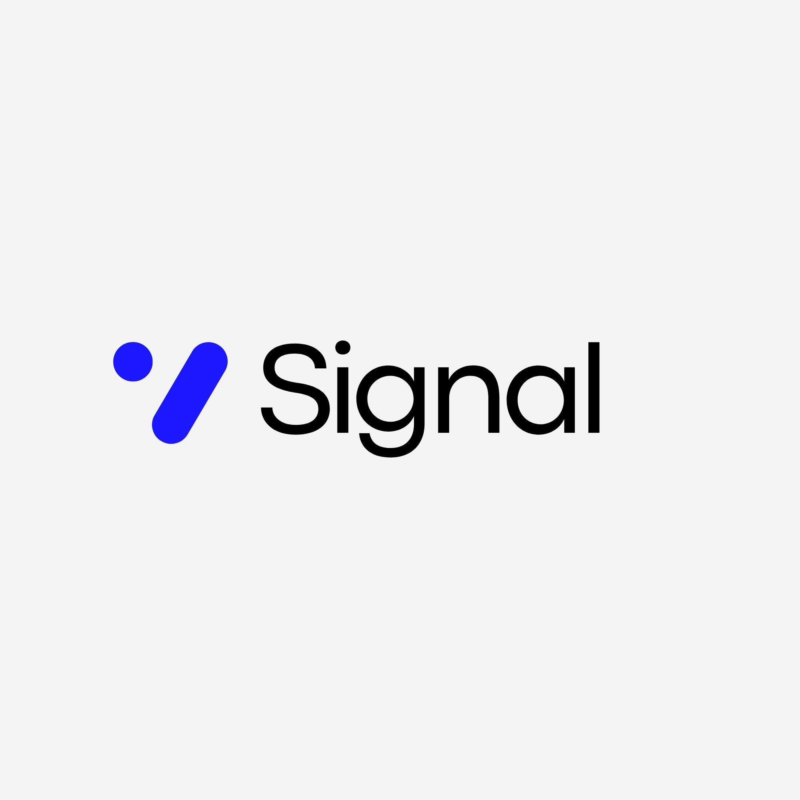

# Signal

## What is Signal?

A decision agent that fetches your emails, calendar, tasks, and OKRs — scores every item against your mission — and outputs a strict signal report in under 250 words.

**Signal density over volume. Mission alignment over busyness.**



## Why Signal?

> "Elon is at 100%. He has no noise in his life. He works 80 to 100 hours a week, and every single hour is signal."
> — Kevin O'Leary, *The Diary of a CEO - The 100% Signal Philosophy: Is It Even Possible?*

Kevin O'Leary's claim that Musk operates at 100% Signal raises a fundamental question: Can a human truly function without any noise? The answer lies not in complete elimination of distractions, but in redefining what Signal means. For Musk, even "relaxation" is strategically planned Signal.

[](https://www.youtube.com/watch?v=mpAZehPviLQ)

*Credits to and inspired by:*
- **The Diary Of A CEO** @TheDiaryOfACEO
- **Kevin O'Leary** @kevinoleary


## Install

```bash
npx skills add seyhunakyurek/signal-os
```

Or install directly:

```bash
npx skills add https://github.com/seyhunakyurek/signal-os
```

## How it works

```
Gmail + Calendar + Tasks + OKRs
        ↓
   Score (0–100)
        ↓
   Classify
        ↓
  📊 Signal Report → Obsidian
```

| Source | What it fetches |
|--------|-----------------|
| Gmail | Unread emails (last 24h) |
| Calendar | This week's events |
| Tasks | Active tasks |
| Google Docs | Your OKR document |

## Scoring

Every item is scored against your mission:

| Factor | Weight |
|--------|--------|
| Mission alignment | 30% |
| Business impact | 25% |
| Urgency | 20% |
| Strategic leverage | 15% |
| Context switching cost | -10% |

| Score | Classification | Action |
|-------|---------------|--------|
| 80–100 | 🔥 Critical Signal | Act now |
| 60–79 | ⚡ Supporting Signal | Keep |
| 40–59 | Neutral | Defer |
| 20–39 | 🗑 Noise Candidate | Delete |
| 0–19 | 🗑 Pure Noise | Delete |

## Usage

Say any of these to trigger:

- "signal report"
- "daily brief"
- "signal check"
- "what needs my attention"
- "what should I focus on"

## Setup

### 1. Composio

```bash
export COMPOSIO_API_KEY="your_key_here"
```

### 2. Google connections

The skill will prompt you to authenticate Gmail, Calendar, Tasks, and Docs on first run.

### 3. OKR Document

Set your OKR document ID in `config.json`:

```json
{
  "okr_document_id": "your_google_doc_id"
}
```

### 4. Obsidian vault

Reports auto-save to:

```
~/Documents/Obsidian/Seyhun Akyurek/Daily Signal Reports/YYYY-MM-DD Signal Report.md
```

## Config

Edit `config.json`:

```json
{
  "okr_document_id": "YOUR_OKRS_DOC_ID_HERE",
  "obsidian_vault": "YOUR_OBSIDIAN_VAULT_PATH_HERE",
  "email_filter": "is:unread newer_than:1d",
  "calendar_range": "current_week",
  "max_output_words": 250,
  "critical_threshold": 80,
  "supporting_threshold": 60,
  "neutral_threshold": 40,
  "noise_threshold": 20
}
```

## Refresh MCP URL

If the Composio connection expires:

```bash
python3 skills/signal-os/scripts/refresh_mcp.py
```

## Philosophy

> "The goal is not to do more — it's to do only what matters."

Every email, meeting, and task is either Signal (moves you toward your mission) or Noise (doesn't). This skill helps you see the difference instantly.

---

*Built for operators who measure output, not hours.*

## License

This project is licensed under the MIT License - see the [LICENSE.md](LICENSE.md) file for details.

## Author

Seyhun Akyurek - (WeCrafted) we-crafted.com - 2026